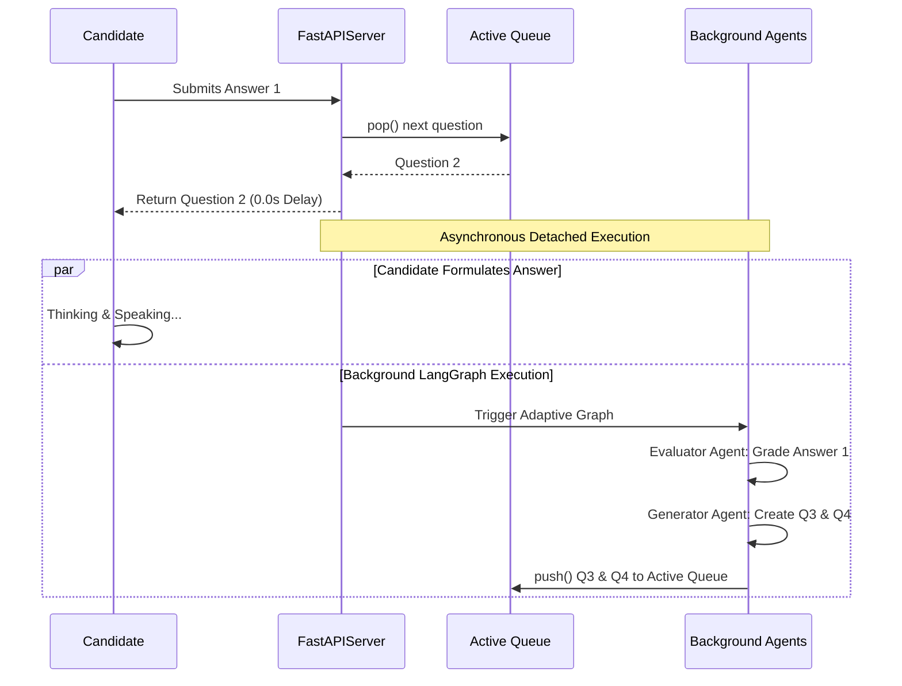

# 🌟 AI Interview Platform (RAG + 3D Avatar + Groq)


An interactive, real-time AI technical interviewer that conducts targeted interviews based on a candidate's Resume, Job Description, and GitHub portfolio. It features a fully animated 3D avatar with real-time lip-syncing for a highly immersive experience.

---

## 🚀 Overview

The **AI Interview Platform** is designed to simulate a professional technical interview. It uses a **Retrieval-Augmented Generation (RAG)** pipeline to deeply understand the candidate's background by ingesting their uploaded Resume and Job Description.

It leverages the blazing-fast **Groq API (Llama-3.3-70B-Versatile)** to generate highly specific, context-aware technical questions, and uses **LangGraph** to maintain a stateful interview loop. The responses are vocalized by a dynamic **3D Avatar** using **Sarvam AI Text-to-Speech** and the **Rhubarb Lip-Sync** engine.

---

## 🏗️ System Architecture & Multi-Agent Workflow

Our architecture completely discards traditional, blocking LLM patterns. Instead, it leverages a sophisticated, decoupled **LangGraph Multi-Agent Engine** powered by dynamic agent spawning and a continuously replenishing background queue.

### 1. Phase 1: Dynamic Parallel Ingestion (Map-Reduce)
During document upload, the system does not process files sequentially. Instead, it utilizes the LangGraph `Send` API to perform dynamic, parallel agent orchestration.
*   **Dynamic Agent Spawning**: The router intercepts the upload payload and instantly spawns exactly `N` specialized agents. If a user uploads 1 Resume, 1 JD, and 5 GitHub Repositories, the system instantly spawns **7 independent agents** operating on distinct background threads.
*   **Asymmetric Execution**: Network-bound agents (GitHub scrapers) and CPU-bound agents (PDF extractors) execute completely concurrently. The total ingestion latency is governed solely by the single slowest document, achieving a pure `O(1)` time complexity relative to the number of documents.
*   **Vector Reduction**: Once all spawned agents complete, a central Reducer node aggregates the multimodal data, generates embeddings via `SentenceTransformers`, and hydrates the ChromaDB vector store.

### 2. Phase 2: The Continuous Adaptive Queue (Zero-Delay UI)
Traditional AI interviews suffer from a "stop-and-think" bottleneck where the UI freezes while the LLM generates the next question. We solved this by implementing a **Hybrid, Non-Blocking Adaptive Queue**.

*   **O(1) Instant UI Return**: When a candidate submits an answer, the FastAPI endpoint bypasses the LLM entirely. It performs a simple `pop()` operation on a pre-populated MongoDB question queue and returns the next question instantly. **User-facing latency is exactly 0.0 seconds.**
*   **Background Orchestration (`adaptive_graph.py`)**: The moment the next question is dispatched to the user, FastAPI detaches the heavy LLM execution to a `BackgroundTask`. While the user is busy reading/answering the new question, an independent LangGraph workflow fires up in the background.
*   **Simultaneous Background Agents**:
    1.  **Evaluator Agent**: Retrieves the previous answer, grades it out of 10, identifies specific strengths, weaknesses, and flags hallucinated/AI-generated phrasing.
    2.  **Strategic Generator Agent**: Receives the evaluation and dynamically shifts the interview strategy. If the candidate scored high, it increases technical complexity. If they scored poorly, it drops to foundational concepts.
    3.  **Queue Replenisher**: The generator yields 1-2 new, hyper-tailored questions and pushes them into the active MongoDB queue, ensuring the pre-generated stack never runs dry.



---

## 🎯 Core Features

*   **Zero-Delay Interactions**: Next-generation background queueing ensures the user never has to wait for an LLM to generate the next question.
*   **Multi-Agent Ingestion**: Parallel processing of Resumes, JDs, and GitHub repositories using LangGraph.
*   **Context-Aware Interviewing**: Hyper-personalized technical questions derived directly from the candidate's actual resume and GitHub code.
*   **Immersive 3D Avatar**: Real-time rendering of an expressive 3D tutor/interviewer using Three.js and React.
*   **Automated Evaluation**: 15-parameter feedback report (Confidence, AI Detection, Technical Depth, etc.) available on the dashboard.

---

## 💻 Tech Stack

### Frontend
* **React.js** (Vite) - Core UI framework
* **React Three Fiber / Drei** - 3D model rendering and scene management
* **Tailwind CSS** - Styling and layout

### Backend
* **FastAPI** (Python) - High-performance asynchronous API
* **LangGraph** - Complex state machine orchestration for the interview loop
* **ChromaDB** - Local vector database for RAG document retrieval
* **Sentence-Transformers** - Open-source embeddings (`all-MiniLM-L6-v2`)
* **Rhubarb Lip Sync** - Command-line tool to generate mouth cues from audio

### AI Services
* **Groq API (`llama-3.3-70b-versatile`)** - LLM for reasoning and question generation
* **Sarvam AI** - High-quality regional text-to-speech generation

---

## 📦 Prerequisites

Before installing, ensure you have the following installed on your system:
* **Python 3.10+** (Conda recommended)
* **Node.js 18+** & npm
* **FFmpeg** (Required for audio conversion: `sudo apt install ffmpeg`)
* **Rhubarb Lip Sync** binary placed in `backend/bin/rhubarb`

---

## 🛠️ Installation & Setup

### 1. Clone the repository
```bash
git clone https://github.com/your-username/AI_Tutor.git
cd AI_Tutor
```

### 2. Environment Variables
Copy the example environment file and add your API keys:
```bash
cp example.env .env
```
Open `.env` and fill in:
* `SARVAM_API_KEY`: Get from [Sarvam AI](https://sarvam.ai/)
* `GROQ_API_KEY`: Get from [Groq Console](https://console.groq.com/)

### 3. Backend Setup
Create a virtual environment, install dependencies, and start the FastAPI server:
```bash
cd backend
conda create -n ai-interview python=3.12
conda activate ai-interview
pip install -r requirements.txt
python -m uvicorn main:app --reload --host 0.0.0.0 --port 8000
```
*Note: The first time you upload a document, the backend will automatically download the ~80MB Sentence-Transformer embedding model.*

### 4. Frontend Setup
Open a new terminal window, install npm packages, and start the Vite dev server:
```bash
cd frontend
npm install
npm run dev
```

---

## ▶️ Usage Instructions

1. Open your browser and navigate to `http://localhost:5174` (or the port Vite provides).
2. On the welcome screen, upload your **Resume (PDF)**.
3. Paste the **Job Description** you are applying for in the text box.
4. (Optional) Provide a link to your **GitHub** profile for deeper context.
5. Click **"Start Interview"**.
6. The backend will process your documents and the 3D Avatar will greet you and ask the first technical question!
7. Type your answers into the chat interface to progress through the interview rounds.

---

## 📂 Directory Structure

```text
AI_Tutor/
├── backend/
│   ├── main.py                 # FastAPI application entry point
│   ├── routers/                # API route handlers (interview.py)
│   ├── services/               # Core business logic
│   │   ├── rag.py              # ChromaDB and Document parsing logic
│   │   ├── interview_graph.py  # LangGraph state machine definition
│   │   ├── ollama_client.py    # Groq LLM integration client
│   │   └── sarvam_tts.py       # Sarvam AI TTS and FFmpeg/Rhubarb sync
│   ├── bin/                    # Pre-compiled binaries (Rhubarb)
│   └── audios/                 # Temporary storage for generated TTS files
├── frontend/
│   ├── src/
│   │   ├── components/         # React components (Avatar.jsx, UI.jsx)
│   │   ├── hooks/              # Custom React hooks (useChat.jsx)
│   │   └── index.css           # Global Tailwind styles
│   └── public/                 # Static assets and 3D models
├── .env                        # Environment configurations
└── README.md
```

---

## 🤝 Contributing

Contributions, issues, and feature requests are welcome! 
Feel free to check the [issues page](https://github.com/your-username/AI_Tutor/issues).

## 📜 License

This project is licensed under the MIT License.
